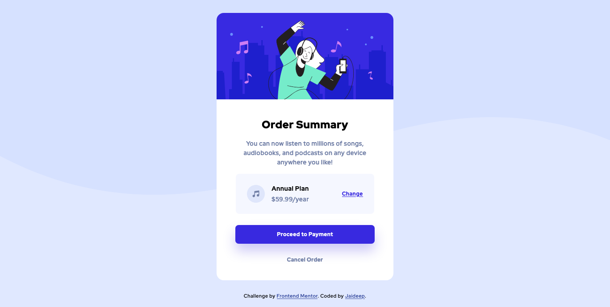
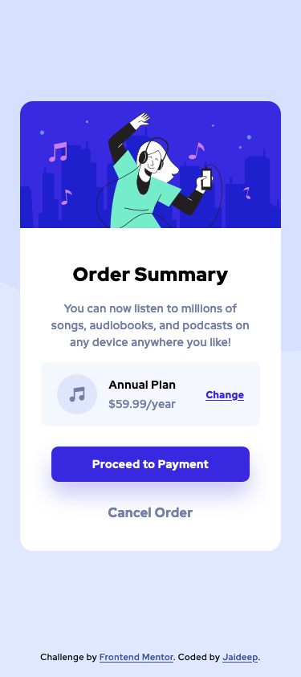

# Frontend Mentor - Order summary card solution

This is a solution to the [Order summary card challenge on Frontend Mentor](https://www.frontendmentor.io/challenges/order-summary-component-QlPmajDUj). Frontend Mentor challenges help you improve your coding skills by building realistic projects.

## Table of contents

- [Frontend Mentor - Order summary card solution](#frontend-mentor---order-summary-card-solution)
  - [Table of contents](#table-of-contents)
  - [Overview](#overview)
    - [The challenge](#the-challenge)
    - [Desktop Screenshot](#desktop-screenshot)
    - [Mobile Screenshot](#mobile-screenshot)
    - [Links](#links)
  - [My process](#my-process)
    - [Built with](#built-with)
    - [What I learned](#what-i-learned)
    - [Continued development](#continued-development)
  - [Author](#author)

## Overview

### The challenge

Users should be able to:

-   See hover states for interactive elements

### Desktop Screenshot

### Mobile Screenshot

  

### Links

-   Solution URL: [Frontend Solution Submission](https://www.frontendmentor.io/solutions/responsive-order-summary-card-challenge-using-css-VxJ-UEC7m)
-   Live Site URL: [Vercel Deployment](https://order-summary-card-bglvqyx3e-jaideepguntupalli.vercel.app)

## My process

### Built with

-   Semantic HTML5 markup
-   CSS
-   Flexbox
-   CSS Grid
-   Desktop-first workflow

### What I learned

I learnt how to use flex as well as how desktop-first development kind of suck even though I like to do it that way. It sucks as in when I come to mobile I generally become lazy so if I get mobile first out of the way the intresting stuff could keep my interest level up.

### Continued development

I have started understanding how cards are made generally but from my next challenge i would love to explore advanced css like trying out scss or sass so that my speed of solving this challenge increase.

## Author

-   Blog - [Jaideep Guntupalli](https://blog.jaideepguntupalli.com)
-   Frontend Mentor - [@JaideepGuntupalli](https://www.frontendmentor.io/profile/JaideepGuntupalli)
-   Twitter - [@gjdeep](https://www.twitter.com/gjdeep)
